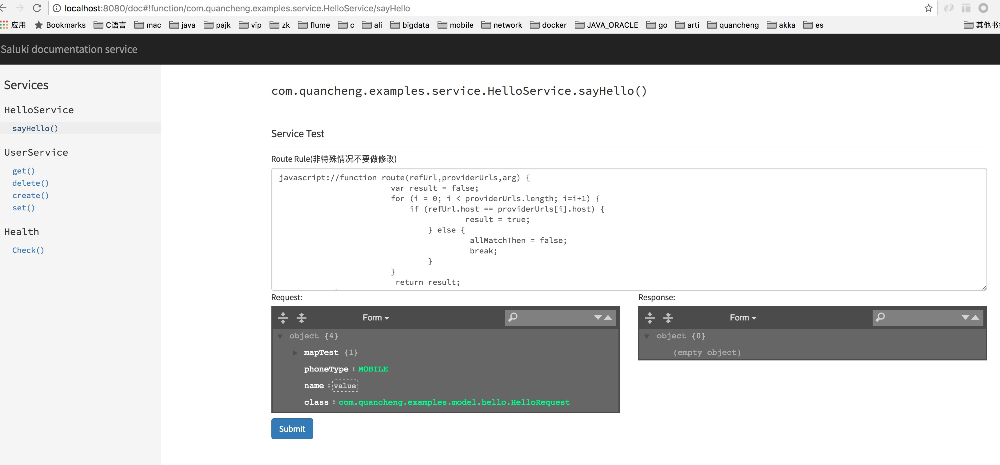

# 概述

saluki是以Grpc作为底层，提供一套高性能、易于使用的分布式远程服务调用(RPC)框架

# 功能

* 服务注册及发现，提供集群环境的服务发现及治理能力
* 服务路由，基于javascript路由规则配置及host的路由规则配置
* 熔断机及隔离，基于hystrix来进行的熔断、隔离
* 简化开发方式，对于Grpc原生stub方式进行封装，提供了使用interface和java Bean作为服务契约的方式
* 与spring-boot进行集成，提供了autoconfig的方式

# 详细说明

* saluki-plugin提供的插件可以在grpc插件基础上生成interface及java bean
* saluki-serializer提供了将protobuf与java bean两者对象互相转换
* saluki-registry提供了服务注册，可以在此扩展，目前仅支持consul

# Compile
```
   mvn install -Dmaven.test.skip=true
   
```
# Quick Start

* 首先在proto文件工程配置grpc提供的gradle货maven插件生成stub

```
<build>
  <extensions>
    <extension>
      <groupId>kr.motd.maven</groupId>
      <artifactId>os-maven-plugin</artifactId>
      <version>1.4.1.Final</version>
    </extension>
  </extensions>
  <plugins>
    <plugin>
      <groupId>org.xolstice.maven.plugins</groupId>
      <artifactId>protobuf-maven-plugin</artifactId>
      <version>0.5.0</version>
      <configuration>
        <protocArtifact>com.google.protobuf:protoc:3.0.2:exe:${os.detected.classifier}</protocArtifact>
        <pluginId>grpc-java</pluginId>
        <pluginArtifact>io.grpc:protoc-gen-grpc-java:1.2.0:exe:${os.detected.classifier}</pluginArtifact>
      </configuration>
      <executions>
        <execution>
          <goals>
            <goal>compile</goal>
            <goal>compile-custom</goal>
          </goals>
        </execution>
      </executions>
    </plugin>
  </plugins>
</build>

```
* 再次添加saluki提供的gradle或maven插件根据protoc文件生成interface及pojo模型

```
<dependency>
	<groupId>com.quancheng.saluki</groupId>
	<artifactId>saluki-core</artifactId>
	<version>1.5.3-SNAPSHOT</version>
	<scope>provided</scope>
</dependency>

<plugin>
	<groupId>com.quancheng.saluki</groupId>
	<artifactId>saluki-maven-plugin</artifactId>
	<version>1.5.3-SNAPSHOT</version>
	<configuration>
		<protoPath>src/main/proto</protoPath>
		<buildPath>target/generated-sources/protobuf/java</buildPath>
	</configuration>
	<executions>
		<execution>
			<goals>
				<goal>proto2java</goal>
			</goals>
		</execution>
	</executions>
</plugin>

```

* 应用上两步生成的artifactId，添加spring-boot-saluki依赖

```
<dependency>
	<groupId>com.quancheng.saluki</groupId>
	<artifactId>spring-boot-starter-saluki</artifactId>
	<version>1.5.3-SNAPSHOT</version>
</dependency>
<dependency>
	<groupId>com.quancheng.saluki</groupId>
	<artifactId>spring-boot-starter-saluki-monitor</artifactId>
	<version>1.5.3-SNAPSHOT</version>
</dependency>
```

* 启动spring boot main，并访问localhost:8080/doc,可进行服务测试

