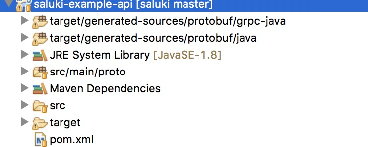

# 概述

saluki-example-api: 类似dubbo的api，作为服务端和客户端的调用契约
saluki-example-client: 客户端
saluki-example-server: 服务端

# Quick Start

* 首先安装consul作为注册中心
  安装命令是：
  
```
  docker run -d -p 8400:8400 -p 8500:8500/tcp -p 8600:53/udp -e 'CONSUL_LOCAL_CONFIG={"bootstrap_expect":1,"datacenter":"dc1","data_dir":"/usr/local/bin/consul.d/data","server":true}' consul agent -server -ui -bind=127.0.0.1 -client=0.0.0.0
  
```
* 在salukie-example下mvn clean install -Dmaven.test.skip=true

* 将grpc生成的stub代码及saluki生成interface、bean加入到classpath下
     

* 启动saluki-example-server服务端,SalukiExampleServerApp 直接main启动

* 启动saluki-example-client客户端,SalukiExampleClientApp 直接main启动

* 访问http://localhost:8081/proxy/hello查看服务调用是否成功

# 功能

* api限流，利用令牌桶机制进行限流操作
* 授权，oauth2进行api的授权
* 协议转化，将http的请求转化为grpc的服务请求

# 系统后台管理
